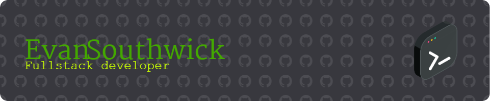

  
###

  
   
   

  

# 💻 Tech Stack: 
 
 

 
 
 
 
 
 
 
 
 
 
 
 

 
 

# My Projects
- **[Angular Notepad App](https://github.com/ESouthwick/notepad)**: A note-taking app with drag-and-drop functionality and a streamlined UI.
- **[React Tile Board](https://github.com/ESouthwick/TileBoard)**: A board tracker for a Clan Tile Race in OSRS also have a simular repo with a connecting discord bot.

###
